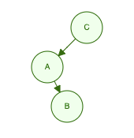
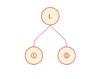
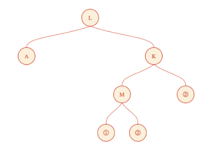
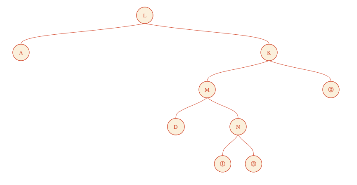
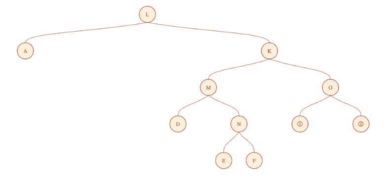
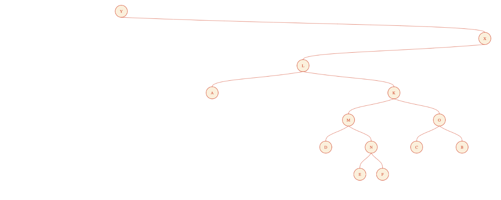

# CS 1501 – Lab #2 (Binary Tree)

## Table of Contents

- [Overview](#overview)
- [@TODO #1 - Interactive SubTree Builder](####-@TODO-#1---Interactive-SubTree-Builder)
- [@TODO #2 & #3 - Read/Write Binary Tree File](####-@TODO-#2-&-#3---Read/Write-Binary-Tree-File)
- [Testing](#testing)
- [Important Notes](#important-notes)

## Overview

* __Purpose__:  In this lab you will complete the code implementation of an
in-order traversing binary tree CRUD program in Java. Our program will support
reading from & writing to file, and provide an interactive prompt for all features.

A starter project has been provided in this repository. You will fill in the missing
code implementation of our binary tree program inside the class file __`TreeFile.java`__.

There are a total of __three__ code implementation tasks, each defined inside
numbered __`@TODO`__ objective comment blocks.

The __`TreeFile`__ class provides a constructor that reads a numeric option from stdin
and executes the feature that matches the given menu option number. Our __`TreeFile`__
class will have a user menu prompt with 6 options to choose from. The menu is
provided upon calling the private __`menu()`__ method, which reads and returns user
input, an integer value ranging from `1` to `6`, as shown below:

```java
/**
 * Displays the program menu and read user selection.
 * Input values must be within the range of 1 ~ 6 (inclusive).
 * @return A numeric choice value
 */
private int menu () {
	System.out.println("*********************************");
	System.out.println("Welcome to CS 1501 Persistent Tree Program!");
	System.out.println("1. Read tree from a file");
	System.out.println("2. Display inorder traversal of the tree");
	System.out.println("3. Attach tree as left child to a new root");
	System.out.println("4. Attach tree as right child to a new root");
	System.out.println("5. Write tree to a file");
	System.out.println("6. Exit.");
	System.out.println("*********************************");
	System.out.print("Please choose a menu option (1-6): ");

	int choice = Integer.parseInt(inScan.nextLine());
	return choice;
}
```

---

#### @TODO #1 - Interactive SubTree Builder

The menu prompt allows you to build an in-order traversing binary tree from scratch
using options `2`, `3`, and `4`, of which you will have to complete the feature
for option `4` by implementing the __`@TODO`__ objective inside the constructor code:

```java
/* TreeFile.java */

// Inside the TreeFile() Constructor:

switch (menu()) {
	// ...

	case 2:
		inorderTraverse(bTree);
		break;

	case 3:
		System.out.println("Enter new root's character data:");
		userInput = inScan.nextLine();
		bTree = new BinaryNode<>(userInput.charAt(0), bTree, null);
		break;

	case 4:
		System.out.println("Enter new root's character data:");
		userInput = inScan.nextLine();
		/**
		 * @TODO #1
		 *
		 * Create a new node that has the existing tree as its right child
		 * and assign in to the private bTree property.
		 */
		break;

	// ...
}

```

Once you complete this task, you should be able to create a basic binary tree
using the menu prompt.

> Note: The menu prompt does not allow us to generate balanced trees.

For example, suppose I want to build the binary tree as shown below:



If `N(v, l, r)` represents the BinaryNode constructor from our code, then the
tree above can be written as:

`N("C", N("A", null, N("B", null, null)), null)`

The program builds a tree from the bottom up, so I could choose to start from
node `"B"` and attach my way up! The prompt output to produce our tree above would be:

```
$ java TreeFile
*********************************
Welcome to CS 1501 Persistent Tree Program!
1. Read tree from a file
2. Display inorder traversal of the tree
3. Attach tree as left child to a new root
4. Attach tree as right child to a new root
5. Write tree to a file
6. Exit.
*********************************
Please choose a menu option (1-6): 3
Enter new root's character data:
B
*********************************
Welcome to CS 1501 Persistent Tree Program!
1. Read tree from a file
2. Display inorder traversal of the tree
3. Attach tree as left child to a new root
4. Attach tree as right child to a new root
5. Write tree to a file
6. Exit.
*********************************
Please choose a menu option (1-6): 4
Enter new root's character data:
A
*********************************
Welcome to CS 1501 Persistent Tree Program!
1. Read tree from a file
2. Display inorder traversal of the tree
3. Attach tree as left child to a new root
4. Attach tree as right child to a new root
5. Write tree to a file
6. Exit.
*********************************
Please choose a menu option (1-6): 3
Enter new root's character data:
C
*********************************
Welcome to CS 1501 Persistent Tree Program!
1. Read tree from a file
2. Display inorder traversal of the tree
3. Attach tree as left child to a new root
4. Attach tree as right child to a new root
5. Write tree to a file
6. Exit.
*********************************
Please choose a menu option (1-6): 2
A
B
C
*********************************
Welcome to CS 1501 Persistent Tree Program!
1. Read tree from a file
2. Display inorder traversal of the tree
3. Attach tree as left child to a new root
4. Attach tree as right child to a new root
5. Write tree to a file
6. Exit.
*********************************
Please choose a menu option (1-6): 5
Please enter tree filename:
myTree.txt
*********************************
Welcome to CS 1501 Persistent Tree Program!
1. Read tree from a file
2. Display inorder traversal of the tree
3. Attach tree as left child to a new root
4. Attach tree as right child to a new root
5. Write tree to a file
6. Exit.
*********************************
Please choose a menu option (1-6): 6

```

- The program starts with the current tree as `null`, so you can choose either
	option (`3` or `4`) when creating a new Leaf Node `"B"` (I chose option `3`).

- We can visually confirm our tree from the in-order traversal output using option `2`.
	The tree should correctly read `"A\nB\nC\n"` as shown above.

- The text file for this demo (`./myTree.txt`) is included in the root of the Lab
	repository. Read the file line by line as if you're using the `readTree()`
	method to see how the program would later parse the text back into a binary
	tree.

---

#### @TODO #2 & #3 - Read/Write Binary Tree File

In addition to the user interactive binary tree operations, __`TreeFile`__ also
supports loading in saved binary trees from file (option `1`) and writing the
current binary tree to file (option `5`). Reading and writing binary trees are
provided via __`readTree()`__ and __`writeTree()`__ methods respectively, and
you must complete each feature by implementing the missing __`@TODO`__ objectives.


```java
/* TreeFile.java */

private BinaryNode<Character> readTree (Scanner file) throws IOException {
	BinaryNode<Character> result = null;

	if (file.hasNext()) {
		String line = file.nextLine();

		if (line.charAt(0) == 'I') { // Internal Node
			/**
			 * @TODO #2
			 *
			 * Replace null below with a new node and recursively call
			 * readTree() on its left and right children
			 */
			result = null;
		} else if (line.charAt(0) == 'L') { // Leaf Node
			result = new BinaryNode<>(line.charAt(2));
		} else { // NULL child
			result = null;
		}
	}
	return result;
}
```

```java
/* TreeFile.java */

private void writeTree (FileWriter file, BinaryNode<Character> root) throws IOException {
	if (root != null) {
		if (root.left == null && root.right == null) { // Write Leaf Node
			/**
			 * @TODO #3
			 *
			 * Write the tree node text line for a Leaf Node and return.
			 * Ex) "L %root.data%"
			 */
		} else { // Write Internal Node
			file.write("I " + root.data + "\n");
		}
		writeTree(file, root.left);
		writeTree(file, root.right);
	} else {
		file.write("N " + "\n"); // Write NULL Child (as "N")
	}
}
```

## Testing

#### Compile & Run

Once all __`@TODO`__ objectives have been implemented, test the __`TreeFile`__
Java program after compiling our source code into bytecode class files.

```sh
$ cd #YOUR_LAB2_DIRECTORY
$ javac ./TreeFile.java
$ java TreeFile

*********************************
Welcome to CS 1501 Persistent Tree Program!
1. Read tree from a file
2. Display inorder traversal of the tree
3. Attach tree as left child to a new root
4. Attach tree as right child to a new root
5. Write tree to a file
6. Exit.
*********************************
Please choose a menu option (1-6):

```

From here you can test out all the features of our program, continuously returning
back to the menu prompt until you exit the program with option `6`.


#### Sample Test Suite

Also included in the root directory of this lab repo are three text files
used for a sample test run:

__`sample.txt`__: Initial tree file to read data from.

__`expectedoutput.txt`__: Shell output of the sample test run.

__`tree1.txt`__: Tree file written during sample test run.

You can follow the exact steps as the sample test run to see if
it produces the same __`tree1.txt`__ and output as shown in __`expectedoutput.txt`__.

> Note: This test suite is used for auto-grading your submission on GradeScope,
so make sure you __run this test__ before submitting!

---

##### `readTree()` & `writeTree()` of the Sample Test Suite

The provided sample tree text file can seem like a lot at first, but the intuition
behind this format is rather easy once you visualize the recursive import/export process.

In __`expectedoutput.txt`__, the user loaded in __`sample.txt`__, applied two "attach"
operations (first as Left SubTree of Node `"X"`, which then became the Right SubTree of Node `"Y"`),
and wrote the new tree to the file __`tree1.txt`__. Lets go over __`readTree()`__ of __`sample.txt`__
and __`writeTree()`__ of __`tree1.txt`__ step by step to see how the tree got
imported and exported, respectively.

##### 1. `readTree()` of `sample.txt`

As stated in the __`@TODO`__ objective, if a __`readTree()`__ call encounters a line
that starts with an `"I"`, it will create a node with the data value set to the next character
on the same line, with a Left subtree created recursively first, and then a right subtree
created recursively second.

> A `"L"` line or `"N"` line would be our base cases,
since those do not call any further functions and returns a value back up the chain.

So essentially, the Left child node constructor will be called repeatedly until
a `"L"` or `"N"` line appears, upon which it will assign the Leaf or Null node
as the left child of the tree, and then call the Right child node constructor,
again, following the "Left-side-first" rule in proceeding recursive calls.

For __`sample.txt`__, we start __`readTree()`__ with the line `"I L"`, so we can
imagine the following buildup in our heads:

`N("L", ⓵, ⓶)` with `⓵` becoming __`readTree()`__ of the next line, `"L A"`,
which will immediately return `N("A")`, giving us `N("L", N("A"), ⓶)`.

> For simplicity we will write a Leaf node simply as `N("*")`, without second or third arguments.

`⓶` will be __`readTree()`__ at line 3, which is `"I K"`, so we will return a new
node with `N("K", ⓵, ⓶)`, and proceed with the recursive call of the next line
for `⓵` first, and then `⓶` later.

A side-by-side recursion progression upon each line would look like this:

Line 1: `N("L", ⓵, ⓶)`

Line 2: `N("L", N("A"), ⓶)`

Line 3: `N("L", N("A"), N("K", ⓵, ⓶))`

Line 4: `N("L", N("A"), N("K", N("M", ⓵, ⓶), ⓶))`

Line 5: `N("L", N("A"), N("K", N("M", N("D"), ⓶), ⓶))`

Line 6: `N("L", N("A"), N("K", N("M", N("D"), N("N", ⓵, ⓶)), ⓶))`

Line 7: `N("L", N("A"), N("K", N("M", N("D"), N("N", N("E"), ⓶)), ⓶))`

Line 8: `N("L", N("A"), N("K", N("M", N("D"), N("N", N("E"), N("F"))), ⓶))`

Line 9: `N("L", N("A"), N("K", N("M", N("D"), N("N", N("E"), N("F"))), N("O", ⓵, ⓶)))`

Line 10: `N("L", N("A"), N("K", N("M", N("D"), N("N", N("E"), N("F"))), N("O", N("C"), ⓶)))`

Line 11: `N("L", N("A"), N("K", N("M", N("D"), N("N", N("E"), N("F"))), N("O", N("C"), N("B"))))`

> Think of it as using each line to resolve the recursion in `Left` -> `Right` & `⓵` -> `⓶`.

Here is a more visual highlight of the recursion above:

After line 1:



After line 4:



After line 6:



After line 9:



After line 11:


and thats how __`TreeFile`__ keeps the loaded tree from __`sample.txt`__, one
big `BinaryNode` object with multiple layers of left and right child nodes!


##### 2. `writeTree()` to `tree1.txt`

With our tree above loaded into the program, the sample test user

1. Attached our tree as the Left child node of a new node with data `"X"`.
2. Attached that tree as the Right child node of a new node with data `"Y"`.

After the two attach operations, the resulting tree would look like this:



The user writes the tree into a separate file __`tree1.txt`__.
__`tree1.txt`__ is only a small modification of __`sample.txt`__ with three lines
prepended and one line appended (last `"N"` line, which is not part of the modification),
so if we can figure out how to write our sample tree into text, we should be able
to also write __`tree1.txt`__ fairly easily.

Lucky for us, we already have the perfect exportable data representation of the
sample tree, the pseudo-code expression of the tree we went through during __`readTree()`__:

__`N("L", N("A"), N("K", N("M", N("D"), N("N", N("E"), N("F"))), N("O", N("C"), N("B"))))`__

As those who see the similarity might have already noticed, the content of our data column in
__`sample.txt`__ is simply our expression's data values read from left to right
(L, A, K, M, D, N, E, F, O, C, B)! All we have to do is prefix each character with
a whitespace and then either an `"I"` or `"L"` depending on whether its an internal
node or a leaf node, and suffix each pair with a newline feed `/n`.

So what we want for __`tree1.txt`__ is the expression notation of our tree after
the two operations. Both operations are simply encapsulating our tree as the Left
or Right subtree of a new node.

After `1.` our tree can be written as

`N("X", N("L", N("A"), N("K", N("M", N("D"), N("N", N("E"), N("F"))), N("O", N("C"), N("B")))), null)`

And after `2.` our tree can be written as

`N("Y", null, N("X", N("L", N("A"), N("K", N("M", N("D"), N("N", N("E"), N("F"))), N("O", N("C"), N("B")))), null))`

Finally, when writing to file we can use the same trick we used previously, now
also reading in `null` values as separate `"N"` lines.

> And thats how & why an `N` line got added to the end of the file.

---

I hope the above step-by-step guide of each method gave you the background context
of binary tree expression. The programming tasks for this lab are atomic and simple
on their own, but once completed, its worth reviewing the the project source code
in its entirety to get a good grasp on binary trees before moving on to more advanced topics
later in the semester.


## Important Notes

- A __`Scanner`__ object keeps track of its read line internally, so keep that in mind when using recursion.

<!-- - In __`writeTree()`__, although the order in which the data is written to the file may
	seem like we're writing a pre-order traversal binary tree, the program reads
	in tree information in the same order as written from the file and parses it
	recursively into a in-order binary tree as shown in __`readTree()`__. -->
